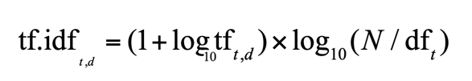

# Coursework : Document Indexing in MapReduce
- author: Eu-Bin KIM (10327741)
- date: 24th of November 2020
- word count : 834 (assume 100 less words)

## Functionality
### tokenisation Case folding
  - selective folding -> I'm not doing this, no.
     - pros: ??? when would you need this though? when would you not want to lower all cases? 
  - lowering all cases (both for index and query)
    - pros: Start of the sentence, in the middle of the sentence -> can normalise them, and this is useful for
      (e.g. stopwords removal)
    - cons: Cannot disambiguate Proper noun from noun. (Can I come up with an example? or maybe a search example?)
      an example ->  " I went to New York". "I bought a new phone".  you cannot disambiguate New from new. 
      - e.g. CAT vs. cat. Apple vs. apple. proper pronoun.. but this downside could be compensated with the relationships
      with other query terms. 
  - simple white space tokenisation
    - pros: simple
    - cons: (domain specific) there are many quotes in wikipedia entries! 

### Stop-words filtering
Stop-words filtering is implemented in line 86 and 161 of the code. Stop-words are words that occur in abundance
 such as "my", "is" and "the". In the code, they are filtered out in the tokenisation process as
  they may hold (Nenadic, 2020) low semantic significance. While this might be helpful for denoising search query,
   there is a domain-specific downside to this. When people search for a particular episode, one might search for a 
   memorable quote from the episode, say, "I did mean it", but the three terms would not have been indexed
    as they are all listed as stop-words in `lib/stopwords.txt`. Although none of the Simpson episode wiki's include the
    quote, but if they did, searching the quote would return nothing. 
    
 
### stemming
  - how? do you stem all the words? or do conditional stemming?
  - pros: ??
  - cons: ??


### Domain-specific filtering
 - how?  -> Using regular expressions. They are implemented as chained java stream filters. in line..(.. 
 - what? -> s
    - filtering out numbers.
    - filtering out isbn.
    - filtering out dates.
 - why? -> the domain of the data matters (tokenisation - slide  9), because.. punctuation
 - limitations -> e.g. Not good if numbers are used as Proper Noun (e.g. the book 1984).


### Document Frequency (DF) and Term Frequency (TF)

> ```
> allow|2	[Bart_the_Fink.txt.gz|3|[423, 548, 603], ...]
> alter|2	[Bart_the_Fink.txt.gz|2|[782, 967], ...]
> air|6	[Bart_the_Fink.txt.gz|3|[147, 205, 220]
> ```
> *Figure 2* : Parts of the Inverted Index for the terms `allow` , `alter` and `american`.
>  DF (next to the term), TF (next to the document) and positional indices (next to TF) are stored. 

*Figure 3* : The formula for TF-IDF weight of a term (Nenadic, 2020). | 
--- |
 | 

 Computation of TF and DF is implemented in line 281 and 320 of the code, respectively. They are necessary to compute TF-IDF weights
  for each term according to the formula in *Figure 3*. TF-IDF weights help us measure the significance of the terms 
  in relation to the documents they appear. Take the index shown in `Figure 2` for example; `air` has higher DF than
   the other two terms while its TF being nearly identical to that of the others.
    Since TF-IDF is inversely proportional to the value of DF (DF is a denominator of the input to a monotonically increasing logarithm),
     we can see that `air` holds less significance in `Bart_the_Fink.txt.gz` than `allow` or `alter` does. 
  

### Positional Indexing

Positional Indexing is implemented in line 205-221 of the code, which utilises `Counter` to keep 
track of term positions. A Positional Index specifies (Christopher D. Manning, et.al, 2008) the positions at which
 the term appears in the postings. For example, *Figure 2* above shows the positional index for `allow`; 
 the term appears at 423rd, 548th and 603rd positions in the document `Bart_the_Fink.txt.gz`.
   Explicitly specifying term positions is useful for an efficient proximity search.
   That is, if we were to search for "allow to alter" on the index(*Figure 2*),
we can efficiently work out that the two terms appear closer in `Bart_the_Fink.txt.gz` than in
 `Bart_the_Lover.txt.gz` (782 - 603 = 179 < 581 - 329 = 252), and that the former should be more relevant to the query than
 the latter.
 
 
## Performance


> in-mapper aggregation | time (seconds)
> --- | --- 
> NO | 21.782
> YES | 22.549
>
> *Figure 4* : The time it took to run jobs, with and without In-mapper Aggregation


In-mapper Aggregation pattern, where aggregation of values takes place (Paton et.al, 2020) in `map`, is used in the code.
 As *Figure 4* illustrates, adopting the pattern has led to an increase in the performance. This is because 
 aggregating intermediate TF's and Positional Index's inside the mapper alleviated the bottleneck caused by
  fewer reducers being available than they are ideally needed. However, it should be noted that this would not have been 
  the case if there existed numerous duplicated terms in each file split; In an extreme case where all file splits
  contains duplicated terms only, the mapper would iterate over `tokens` 2 times (first for aggregation, then for emitting)
   only to produce the same key-value pairs as what simple mapper would produce by iterating `tokens` only once. In such 
   a case, mappers with In-mapper Aggregation pattern would in fact take twice more time than simple mappers would.


## References
- (Christopher D. Manning, et.al, 2008) , *Introduction to Information Retrieval*
  - entry: https://nlp.stanford.edu/IR-book/html/htmledition/irbook.html
  - positional indexing: https://nlp.stanford.edu/IR-book/html/htmledition/positional-indexes-1.html
- Nenadic, Goran. 2020, *Querying and ranking: Ranked retrieval*
  - link: https://online.manchester.ac.uk/bbcswebdav/pid-12081152-dt-content-rid-55239820_1/courses/I3132-COMP-38211-1201-1SE-039876/Workshop-04-02.pdf
- Nenadic, Goran. 2020 *Principles of IR – Indexing*
  - link:  https://online.manchester.ac.uk/bbcswebdav/pid-11983725-dt-content-rid-50339139_1/courses/I3132-COMP-38211-1201-1SE-039876/Workshop-01_04_inverted_index%281%29.pdf
- Paton, Norman. Batista-Navarro, Riza. Sampaio, Sandra. 2020, *Map Reduce Design Patterns*
